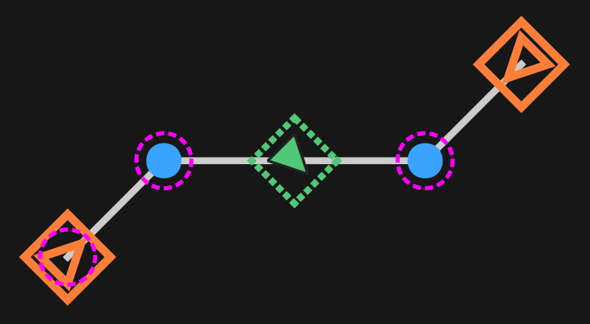

# BLine-Lib

BLine-Lib is a path following library designed for the FIRST Robotics Competition (FRC). It is built around the concept of offering simplicity and performance in time-constrained environments where quick iteration and rapid empirical testing prove advantageous.

Developed in-house by FRC Team 2638 Rebel Robotics, by students for students, with development beginning in late June of 2025, BLine plays into the recent emergence of the FRC polyline path planning meta, with renowned teams such as 2056 and 2910 (among others) running their own solutions during the 2025 Reefscape game.

📚 **[Full Javadoc Documentation](https://javadoc.jitpack.io/com/github/edanliahovetsky/BLine-Lib/latest/javadoc/)** | 🔧 **[BLine-GUI](https://github.com/edanliahovetsky/BLine-GUI)**

## Core Concepts

Before diving into usage, it's important to understand how BLine represents paths.

### Path Elements

A **Path** is a sequence of **path elements** that define where the robot should go and what holonomic rotation it should have:

| Element | Description |
|---------|-------------|
| **Waypoint** | A point with both a position (translation) and holonomic rotation target |
| **TranslationTarget** | A position-only target—the robot drives through this point |
| **RotationTarget** | A rotation-only target that interpolates based on progress along a segment |

### Key Parameters

- **`intermediate_handoff_radius_meters`**: How close the robot must get to a translation target before advancing to the next one. Smaller values = robot waits longer before switching to the next target, great for lower speeds and were waypoint precision is needed, larger values = robot will switch to the next target sooner, great for smoother and more reliable transitions at higher speeds.

- **`t_ratio`**: For rotation targets, this defines *where* along the path segment (0.0 to 1.0) the rotation should be achieved. A value of 0.5 means the robot reaches that holonomic rotation at the midpoint of the segment.

- **`profiled_rotation`**: When `true`, rotation is smoothly interpolated based on position. When `false`, the robot immediately targets the rotation.

## Core Algorithm

The path following algorithm works by:

1. Calculating command robot speed via a PID controller minimizing total path distance remaining
2. Determining velocity direction by pointing toward the current translation target
3. Advancing to the next translation target when within the handoff radius of the current one
4. Applying cross-track correction to stay on the line between waypoints
5. Interpolating rotation based on progress between rotation targets
6. Applying rate limiting via `ChassisRateLimiter` to respect constraints



## Recommended Usage Modes

There are three recommended ways to use BLine, depending on your team's workflow and preferences:

### 🎨 Full Stack: GUI + Lib + JSON

Use the BLine-GUI for visual path planning, with paths stored as JSON files and loaded by the library.

### 📄 JSON Primary: Lib + JSON Loading

Define paths directly in JSON files without using the GUI.

### 💻 Code Only: Lib + Code-Defined Paths

Define all paths and constraints programmatically in Java—no external files needed.

## Performance

A whitepaper on the performance analysis of BLine can be found [here](<!-- TODO: Insert Google Docs link -->).

**Validation Pipeline:** Validated the architecture by building a WPILib physics simulation; utilized Theta* for initial pathfinding and an Artificial Bee Colony (ABC) optimizer to benchmark the system against PathPlanner.

**Quantitative Results:** Data from randomized Monte Carlo trials demonstrated:
- **97% reduction** in path computation time
- **66% reduction** in cross-track error at waypoints
- Negligible **2.6% decrease** in total path following time compared to PathPlanner

A **15.5% increase** in total path cross-track error (CTE) was found across cases. However, this is an artifact of the ABC optimization process which prioritized total path time and collision avoidance with obstacles. CTE was not of critical importance to the optimizer and the deviation is negligible for the majority of FRC use cases. Users can easily reduce cross-track error through tuning of the cross-track-error feedback loop and handoff radii.

## Installation

### Using Vendor JSON (Recommended)

1. Open VS Code with your FRC project
2. Press `Ctrl+Shift+P` (or `Cmd+Shift+P` on Mac)
3. Type **"WPILib: Manage Vendor Libraries"**
4. Select **"Install new libraries (online)"**
5. Paste this URL:

```
https://raw.githubusercontent.com/edanliahovetsky/BLine-Lib/main/BLine-Lib.json
```

### Using Gradle (Alternative)

Add JitPack repository to your `build.gradle`:

```gradle
repositories {
    maven { url 'https://jitpack.io' }
}
```

Add the dependency:

```gradle
dependencies {
    implementation 'com.github.edanliahovetsky:BLine-Lib:0.3.0'
}
```

## Quick Start

### 1. Set Global Constraints

Global constraints define default velocity/acceleration limits and tolerances for all paths. Choose one approach:

**Option A: Using `config.json`** (for JSON-based workflows)

Create a `config.json` file in `src/main/deploy/autos/`:

```json
{
    "default_max_velocity_meters_per_sec": 4.0,
    "default_max_acceleration_meters_per_sec2": 3.0,
    "default_max_velocity_deg_per_sec": 360.0,
    "default_max_acceleration_deg_per_sec2": 720.0,
    "default_end_translation_tolerance_meters": 0.05,
    "default_end_rotation_tolerance_deg": 2.0,
    "default_intermediate_handoff_radius_meters": 0.3
}
```

**Option B: Setting in Code** (for code-only workflows)

Set global constraints programmatically in your robot initialization:

```java
// Set global constraints before creating any paths
Path.setDefaultGlobalConstraints(new Path.DefaultGlobalConstraints(
    4.0,    // maxVelocityMetersPerSec
    3.0,    // maxAccelerationMetersPerSec2
    360.0,  // maxVelocityDegPerSec
    720.0,  // maxAccelerationDegPerSec2
    0.05,   // endTranslationToleranceMeters
    2.0,    // endRotationToleranceDeg
    0.3     // intermediateHandoffRadiusMeters
));
```

### 2. Create a FollowPath Builder

Create a reusable `FollowPath.Builder` in your drive subsystem or `RobotContainer`:

```java
import frc.robot.lib.BLine.*;
import edu.wpi.first.math.controller.PIDController;

// Create a reusable builder with your robot's configuration
FollowPath.Builder pathBuilder = new FollowPath.Builder(
    driveSubsystem,
    driveSubsystem::getPose,
    driveSubsystem::getChassisSpeeds,
    driveSubsystem::drive,
    new PIDController(5.0, 0.0, 0.0),  // translation
    new PIDController(3.0, 0.0, 0.0),  // rotation
    new PIDController(2.0, 0.0, 0.0)   // cross-track
).withDefaultShouldFlip()
 .withPoseReset(driveSubsystem::resetPose);
```

### 3. Create and Follow Paths

**From JSON file:**

```java
// Loads deploy/autos/paths/myPathFile.json
// Note: .json extension is added automatically
Path myPath = new Path("myPathFile");

Command followCommand = pathBuilder.build(myPath);
```

**Programmatically (using path elements from Core Concepts):**

```java
Path myPath = new Path(
    new Path.Waypoint(new Translation2d(1.0, 1.0), new Rotation2d(0)),
    new Path.TranslationTarget(new Translation2d(2.0, 2.0)),
    new Path.Waypoint(new Translation2d(3.0, 1.0), new Rotation2d(Math.PI))
);

Command followCommand = pathBuilder.build(myPath);
```

### 4. Path-Specific Constraints (Optional)

Override global constraints for individual paths using `PathConstraints`:

```java
Path.PathConstraints slowConstraints = new Path.PathConstraints()
    .setMaxVelocityMetersPerSec(2.0)
    .setMaxAccelerationMetersPerSec2(1.5)
    .setMaxVelocityDegPerSec(180.0)
    .setMaxAccelerationDegPerSec2(360.0)
    .setEndTranslationToleranceMeters(0.02)
    .setEndRotationToleranceDeg(1.0);

// Create path with custom constraints
Path slowPath = new Path(
    slowConstraints,
    new Path.Waypoint(new Translation2d(1.0, 1.0), new Rotation2d(0)),
    new Path.TranslationTarget(new Translation2d(2.0, 2.0)),
    new Path.Waypoint(new Translation2d(3.0, 1.0), new Rotation2d(Math.PI))
);
```

You can also use **ranged constraints** to vary limits across different path segments:

```java
Path.PathConstraints rangedConstraints = new Path.PathConstraints()
    .setMaxVelocityMetersPerSec(
        new Path.RangedConstraint(4.0, 0, 2),  // Fast for elements 0-2
        new Path.RangedConstraint(1.5, 3, 5)   // Slow for elements 3-5
    );
```

### 5. Pre-Orient Modules (Recommended)

For optimal autonomous performance, it is highly recommended to pre-orient your swerve modules toward the initial path direction before the match begins. This prevents micro-deviations at the start of the autonomous routine caused by modules needing to rotate during driving.

Use `Path.getInitialModuleDirection()` to get the direction modules should face:

**Option 1: Set modules via a command before auto starts**

```java
// In your autonomous initialization or pre-match routine
Path autoPath = new Path("myAutoPath");
Rotation2d initialDirection = autoPath.getInitialModuleDirection();

driveSubsystem.setModuleOrientations(initialDirection);
```

**Option 2: Physically orient modules during robot setup**

Manually rotate the swerve modules to face the initial path direction before the match starts.

> **Note:** This optimization is primarily for the autonomous phase where precise initial movement matters most.

## Path Construction with JSON

### Using BLine-GUI

BLine-Lib can be used in combination with the [BLine-GUI](https://github.com/edanliahovetsky/BLine-GUI). The BLine-GUI provides a visual interface for planning and editing BLine paths, making it easy to design complex autonomous routines.

### Working Directly with JSON

Although the BLine-GUI is a great way of planning BLine paths, directly working in JSON is also a great method of path construction—whether for small adjustments or complete path construction.

Paths are stored as JSON files in `deploy/autos/paths/`. Example:

```json
{
    "path_elements": [
        {
            "type": "waypoint",
            "translation_target": {
                "x_meters": 1.0,
                "y_meters": 1.0,
                "intermediate_handoff_radius_meters": 0.3
            },
            "rotation_target": {
                "rotation_radians": 0,
                "profiled_rotation": true
            }
        },
        {
            "type": "translation",
            "x_meters": 2.5,
            "y_meters": 2.0,
            "intermediate_handoff_radius_meters": 0.3
        },
        {
            "type": "rotation",
            "rotation_radians": 1.57,
            "t_ratio": 0.5,
            "profiled_rotation": true
        }
    ]
}
```

## API Reference

For complete API documentation, see the **[Javadoc](https://javadoc.jitpack.io/com/github/edanliahovetsky/BLine-Lib/latest/javadoc/)**.

### Path Class

**Constructors:**
- `Path(String filename)` — Load a path from JSON (automatically appends `.json`)
- `Path(PathElement... elements)` — Create a path programmatically
- `Path(PathConstraints, PathElement...)` — Create path with custom constraints

**Static Methods:**
- `Path.setDefaultGlobalConstraints(DefaultGlobalConstraints)` — Set global defaults for all paths

**Instance Methods:**
- `getStartPose()` — Get the starting pose for odometry reset
- `getInitialModuleDirection()` — Get the direction modules should face at path start (recommended for pre-match setup)
- `flip()` / `undoFlip()` — Transform path for opposite alliance

**Path Elements:**
- `Path.Waypoint(Translation2d, Rotation2d)` — Combined translation and rotation target
- `Path.Waypoint(Pose2d)` — Create waypoint from a Pose2d
- `Path.TranslationTarget(Translation2d)` — Translation-only target
- `Path.TranslationTarget(double x, double y)` — Translation target from coordinates
- `Path.RotationTarget(Rotation2d, double t_ratio)` — Rotation target with t-ratio interpolation

### Path.DefaultGlobalConstraints

Constructor parameters (in order):
- `maxVelocityMetersPerSec` — Maximum translational velocity (m/s)
- `maxAccelerationMetersPerSec2` — Maximum translational acceleration (m/s²)
- `maxVelocityDegPerSec` — Maximum rotational velocity (deg/s)
- `maxAccelerationDegPerSec2` — Maximum rotational acceleration (deg/s²)
- `endTranslationToleranceMeters` — Tolerance for final position (m)
- `endRotationToleranceDeg` — Tolerance for final rotation (deg)
- `intermediateHandoffRadiusMeters` — Default handoff radius (m)

### Path.PathConstraints

Fluent builder for path-specific constraints (all methods return `this` for chaining):
- `setMaxVelocityMetersPerSec(double)` — Override max translation velocity
- `setMaxAccelerationMetersPerSec2(double)` — Override max translation acceleration
- `setMaxVelocityDegPerSec(double)` — Override max rotation velocity
- `setMaxAccelerationDegPerSec2(double)` — Override max rotation acceleration
- `setEndTranslationToleranceMeters(double)` — Override end position tolerance
- `setEndRotationToleranceDeg(double)` — Override end rotation tolerance

For ranged constraints, pass `RangedConstraint` objects instead of doubles.

### FollowPath.Builder

**Constructor parameters:**
- `SubsystemBase driveSubsystem` — The drive subsystem to require
- `Supplier<Pose2d> poseSupplier` — Returns current robot pose
- `Supplier<ChassisSpeeds> speedsSupplier` — Returns current robot-relative speeds
- `Consumer<ChassisSpeeds> speedsConsumer` — Accepts robot-relative speeds to drive
- `PIDController translationController` — Controls speed based on distance remaining
- `PIDController rotationController` — Controls holonomic rotation toward rotation targets
- `PIDController crossTrackController` — Minimizes deviation from path line

**Methods:**
- `build(Path path)` — Build a command to follow the specified path
- `withPoseReset(Consumer<Pose2d>)` — Reset pose at path start (useful for auto init)
- `withDefaultShouldFlip()` — Auto-flip paths based on DriverStation alliance
- `withShouldFlip(Supplier<Boolean>)` — Custom flip logic for red/blue alliance

## Building from Source

```bash
./gradlew build
```

Generate Javadoc locally:

```bash
./gradlew javadoc
# Open build/docs/javadoc/index.html
```

## License

BSD 3-Clause License — See [LICENSE](LICENSE) file.
